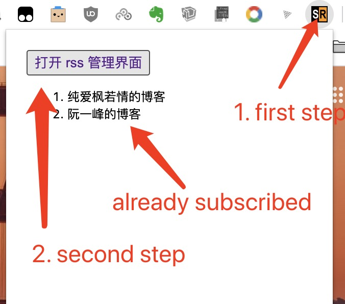
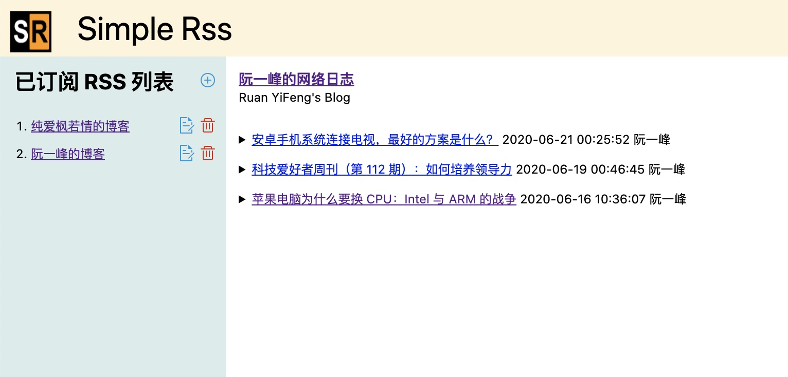

# Simple Rss

Just a simple rss extension for chrome. The simple extension developed by typeScript and react.

## how to install

clone or download this repository.

And then, you can just follow these step to use it.

> 1. Navigate to chrome://extensions in your browser. You can also access this page by clicking on the Chrome menu on the top right side of the Omnibox, hovering over More Tools and selecting Extensions.
> 2. Check the box next to Developer Mode.
> 3. Click Load Unpacked Extension and select the directory for your "Hello Extensions" extension.

If you are confused, please visit the page [https://developer.chrome.com/extensions](https://developer.chrome.com/extensions click go to developer site of chrome extension.)

## how to use

### click the icon 

### management page

